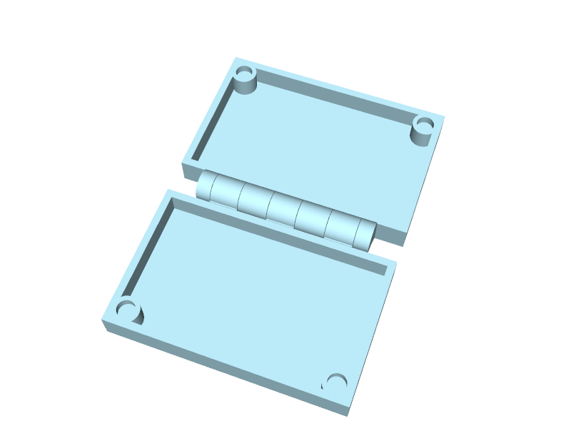

# pip-hinge

A parametric print-in-place piano hinge in [build123d](https://github.com/gumyr/build123d),
designed for clamshell cases.

Four inputs:

```python
from hinge import HingeParams, Knuckle, make_hinge

hinge = make_hinge(HingeParams(
    case_h        = 10,             # case wall height (mm)
    hinge_length  = 60,             # total hinge length along the axis (mm)
    stations      = 6,              # alternating cs/ps tab count (even, ≥ 2)
    knuckle       = Knuckle.FULL,   # FULL = "bump on top", no ramp needed
))
```

`make_hinge()` returns a 2-body `Compound`: the cylinder-side leaf (with
bored knuckle tabs) and the pin-side leaf (with the integral pin).

## In context: a flat-open clamshell with HALF knuckle



Built by [`examples/clamshell.py`](examples/clamshell.py) — case_h = 10mm,
80 × 50 mm footprint, 60 mm hinge with `Knuckle.HALF`, plus four 6 × 3 mm
corner magnet pockets to latch the case shut. Both halves print as one
piece in the orientation shown. The example also emits a bare HALF/FULL
variant (no magnets) for reference.

## The two knuckle options


| `knuckle`      | knuckle diameter            | ramp                  | gap between case walls (flat-open) |
| -------------- | --------------------------- | --------------------- | ---------------------------------- |
| `Knuckle.FULL` | `2 × case_h`                | none — rests on bed   | `2 × (case_h + mounting_flat)`     |
| `Knuckle.HALF` | `case_h`                    | 45° self-supporting   | `case_h + 2 × mounting_flat`       |
| `Knuckle.SMALL`| `max(case_h / 2, 5 mm)`     | ~25° from vertical (smaller knuckle → naturally steeper) | `max(case_h, 10mm) + 2 × mounting_flat` |

See [docs/clamshell-integration.md](docs/clamshell-integration.md) for
mounting, orientation, multi-hinge layouts, and the closed-vs-open view.

## Provenance

This is a port of **["Parametric print-in-place hinge. FreeCAD."](https://www.printables.com/model/1395662-parametric-print-in-place-hinge-freecad)**
by **[r0berts](https://www.printables.com/@r0berts_1183620)** on Printables,
licensed [CC BY 4.0](https://creativecommons.org/licenses/by/4.0/).

The original is a spreadsheet-driven FreeCAD model. This repository:

1. Translates the FreeCAD geometry into build123d Python via
   [fcd2b123d](https://github.com/pzfreo/fcd2b123d).
2. Reparameterises around four case-designer-facing inputs (`case_h`,
   `hinge_length`, `stations`, `knuckle`) with the original dimensional
   relationships derived under the hood.
3. Generalises the comb pattern (hardcoded 6 stations in the original) to
   any even number of stations ≥ 2, and adds an optional
   `Knuckle.HALF` mode with a self-supporting ramp for cases where a
   smaller knuckle is wanted.

Per the CC BY 4.0 terms: design and dimensional relationships are
r0berts'; modifications are the build123d port, the four-input API, and
the configurable station count and ramp.

## Quick start

```bash
uv pip install build123d
python hinge.py    # writes examples/hinge_full.{step,stl} and hinge_half.{step,stl}
```

## Parameters

The four primary inputs:

| Parameter      | Default        | Meaning                                                  |
| -------------- | -------------- | -------------------------------------------------------- |
| `case_h`       | (required)     | Case wall height; the hinge's "scale" reference          |
| `hinge_length` | (required)     | Total hinge length along the axis (Y)                    |
| `stations`     | 6              | Number of alternating cs/ps tabs (even, ≥ 2)             |
| `knuckle`      | `Knuckle.FULL` | `FULL`, `HALF`, or `SMALL` — see the option table below |

Three small tuneables:

| Parameter         | Default | Meaning                                            |
| ----------------- | ------- | -------------------------------------------------- |
| `mounting_flat`   | 1.0     | Flat width past the disc edge for case-wall fusion |
| `pivot_clearance` | 0.6     | Radial pin/bore gap (FDM tolerance)                |
| `clasp_clearance` | 0.4     | Axial gap between cs and ps tabs                   |

Plus three pin-engagement constants from the original FreeCAD source
(`pin_cyl_extra`, `pin_end_offset`, `pin_short_cyl_factor`) — leave at
defaults unless deliberately tuning the pin/bore feel.

## Validation

`make_hinge()` raises `ValueError` for hard geometric problems:
- non-positive `case_h`, `hinge_length`, or negative `mounting_flat`
- `stations < 2` or odd
- bore Ø ≤ `pivot_clearance` (knuckle too small for the pivot clearance)

And warns (`warnings.warn`) when:
- `clasp_width = hinge_length / stations` drops below ~3 mm (too thin for FDM)

## Printing

Lay flat on the bed with the hinge axis along Y (parallel to bed).
0.2 mm layers, fan on, brim recommended. After printing, gently flex the
leaves to break the clearance gaps free.

- **FULL** prints without any supports at any knuckle size — the knuckle
  rests on the bed.
- **HALF** prints without supports as long as `mounting_flat` is small
  enough that the ramp angle stays ≤ 45° (which the default 1 mm satisfies
  for all sensible `case_h`).

## How this was built

The build123d code, API design discussions, station-count generalisation,
self-supporting ramp, clamshell example, and documentation in this
repository were produced through a paired design session with
[Claude Code](https://claude.com/claude-code) (Anthropic's Claude Opus 4.7).
I drove the design decisions — what the API should look like, which
knuckle geometries to support, what trade-offs to accept — and Claude wrote
the code, generated the diagrams, ran the verifications, and opened the
PRs. The conversation is the source of truth for *why* the code looks the
way it does; the commit history reflects the steps.

The original FreeCAD geometry from r0berts is unchanged in its dimensional
relationships — it was reparameterised, not redesigned. The Claude
collaboration is on the build123d port and the case-designer-facing API
built on top of it.

## License

This work is licensed under [Creative Commons Attribution 4.0 International (CC BY 4.0)](https://creativecommons.org/licenses/by/4.0/),
matching the upstream Printables source. See [LICENSE](LICENSE).

When using or redistributing, please credit:

- **r0berts** — original FreeCAD design ([Printables](https://www.printables.com/model/1395662-parametric-print-in-place-hinge-freecad))
- **Paul Fremantle** (pzfreo) — build123d port, four-input parameterisation, station generalisation, and ramp option
