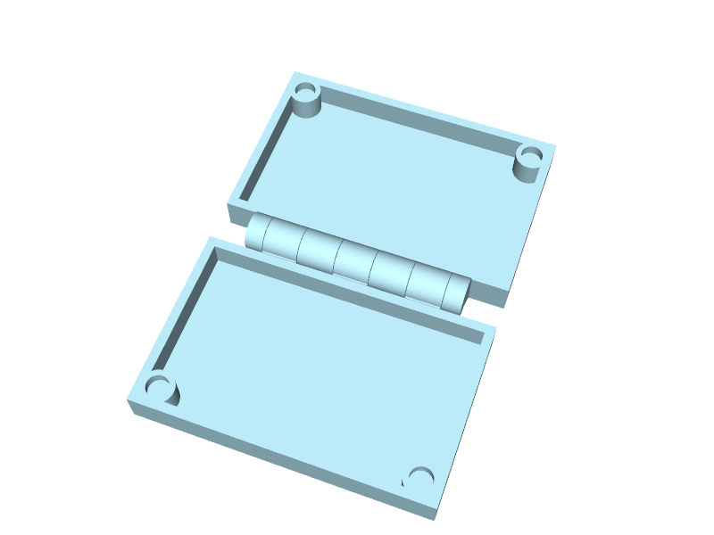
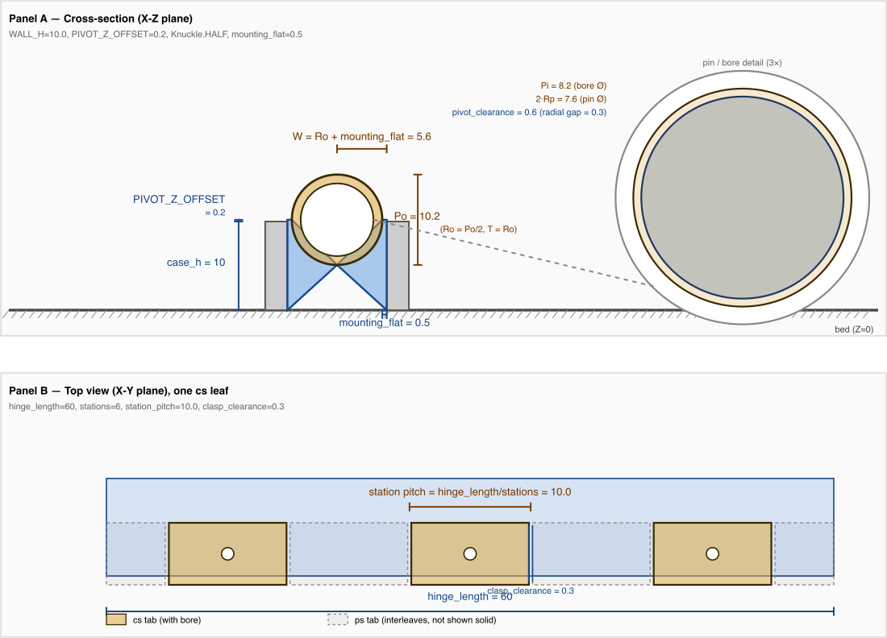
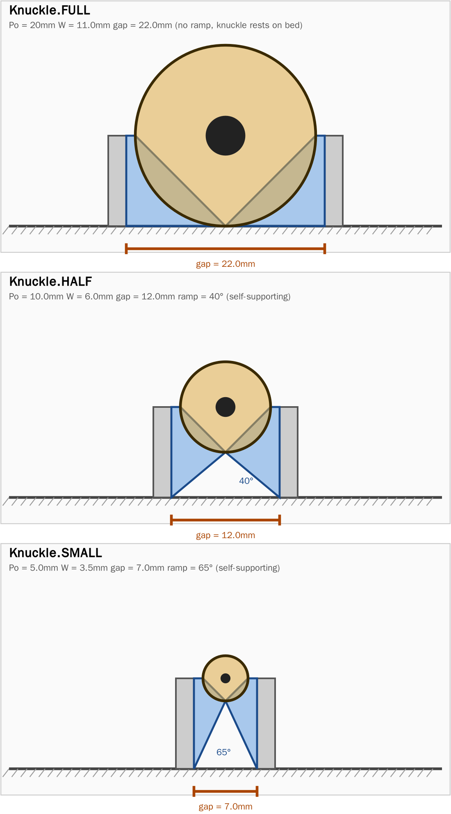
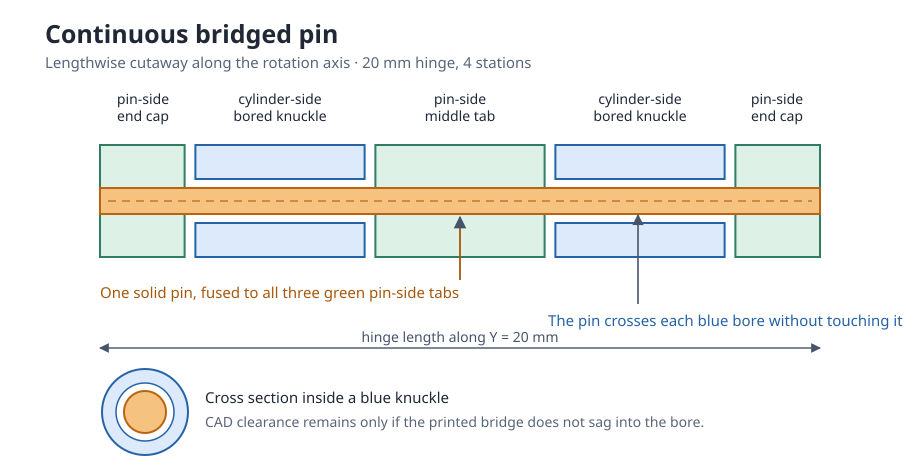

# pip-hinge

A parametric print-in-place piano hinge in [build123d](https://github.com/gumyr/build123d),
designed for clamshell cases.

Four inputs:

```python
from pip_hinge import Knuckle, PinStyle, PrintInPlaceHinge

hinge = PrintInPlaceHinge(
    case_h        = 10,             # case wall height (mm)
    hinge_length  = 60,             # total hinge length along the axis (mm)
    stations      = 6,              # alternating tab count (even, ≥ 2)
    knuckle       = Knuckle.FULL,   # FULL = "bump on top", no ramp needed
)
base_leaf, lid_leaf = hinge.cylinder_side, hinge.pin_side
```

The default pin has 45° conical tips. Choose `PinStyle.ROUNDED` or the
experimental `PinStyle.BRIDGED` with the `pin_style` argument when needed.

`PrintInPlaceHinge` is a build123d `Compound` with two labelled children,
one per leaf:

- **`cylinder_side`** — the leaf whose knuckle tabs carry the bores;
- **`pin_side`** — the leaf with the end caps and the captured pin.

(Internally these are abbreviated *cs* and *ps*.) Each child is a `Compound`,
because a bare leaf can be several solids — see `mounting_flat` below.

`make_hinge(HingeParams(...))` builds the same thing from a reusable
parameter value.

### Where the hinge comes out

The hinge is built flat-open, in print orientation, ready to fuse into a case
whose walls stand on the bed:

- bed at **Z = 0**, wall top at **Z = `case_h`**;
- hinge axis along **Y** through X = 0, Z = `case_h + pivot_z_offset`;
- `cylinder_side` reaches X = +`hinge.leaf_width`, `pin_side` X = −`hinge.leaf_width`
  — those outer faces are where the two case back walls go;
- Y spans ±`hinge_length / 2`.

So for a base whose back wall's outer face is at X = x0, place the leaves
(build123d children are relative to their parent, so move the leaves
themselves, not the hinge):

```python
from build123d import Pos

at = Pos(x0 - hinge.leaf_width, y_centre, 0)
base = base + at * hinge.cylinder_side
lid = lid + at * hinge.pin_side
```

### Joints

`cylinder_side.joints["pivot"]` is a `RevoluteJoint` on the hinge axis and
`pin_side.joints["pivot"]` a matching `RigidJoint`, so the hinge can be swung
in an assembly view (0° = flat-open as printed, 180° = closed):

```python
hinge.cylinder_side.joints["pivot"].connect_to(hinge.pin_side.joints["pivot"], angle=180)
```

Each leaf also has a `"mount"` `RigidJoint` at the bottom centre of its outer
face (X = ±`leaf_width`, Y = 0, Z = 0), axes aligned with the hinge frame. To
attach the hinge to a case wall with joints instead of `Pos`:

```python
from build123d import Location, RigidJoint

RigidJoint("hinge", base, Location((x0, y_centre, 0)))    # back-wall outer face, bottom centre
base.joints["hinge"].connect_to(hinge.cylinder_side.joints["mount"])
hinge.cylinder_side.joints["pivot"].connect_to(hinge.pin_side.joints["pivot"], angle=0)
base = base + hinge.cylinder_side                         # leaves are now in place
lid = lid + hinge.pin_side
```

## In context: a flat-open clamshell with HALF knuckle



Built by [`examples/clamshell.py`](examples/clamshell.py) — case_h = 10mm,
80 × 50 mm footprint, 60 mm hinge with `Knuckle.HALF`, plus four 6 × 3 mm
corner magnet pockets to latch the case shut. Both halves print as one
piece in the orientation shown. The example also emits a bare HALF/FULL
variant (no magnets) for reference.

## Parameter reference



Cross-section (Panel A) shows the spatial parameters: `case_h` (wall
height), `pivot_z_offset` (extra lift), `mounting_flat` (flat past the
disc edge), plus the derived `Po`/`Ro`/`T`/`W` and the pin/bore inset.
Top view (Panel B) shows `hinge_length`, `stations`, derived
station pitch (`hinge_length / stations`), and `clasp_clearance` between tabs.

## Knuckle sizes



| `knuckle`      | knuckle diameter            | ramp                  | gap between case walls (flat-open) |
| -------------- | --------------------------- | --------------------- | ---------------------------------- |
| `Knuckle.FULL` | `2 × (case_h + pivot_z_offset)`          | none — rests on bed   | `2 × (case_h + pivot_z_offset) + 2 × mounting_flat` |
| `Knuckle.HALF` | `case_h + pivot_z_offset`                | 45° self-supporting teardrop | `case_h + pivot_z_offset + 2 × mounting_flat` |
| `Knuckle.SMALL`| `max((case_h + pivot_z_offset) / 2, 5 mm)` | ~25° from vertical (smaller knuckle → naturally steeper) | `max((case_h + pivot_z_offset) / 2, 5 mm) + 2 × mounting_flat` |

The knuckle diameter `Po` is sized to the lifted axis height
`case_h + pivot_z_offset`, and the flat-open gap between the case walls is
always `Po + 2 × mounting_flat` (= `2 × hinge.leaf_width`). For `case_h = 10`
with the defaults that is 21.4 mm (FULL), 11.2 mm (HALF) and 6.1 mm (SMALL).

See [docs/clamshell-integration.md](docs/clamshell-integration.md) for
mounting, orientation, multi-hinge layouts, and the closed-vs-open view.

## Provenance

This is a port of **["Parametric print-in-place hinge. FreeCAD."](https://www.printables.com/model/1395662-parametric-print-in-place-hinge-freecad)**
by **[r0berts](https://www.printables.com/@r0berts_1183620)** on Printables,
licensed [CC BY 4.0](https://creativecommons.org/licenses/by/4.0/).

The original is a spreadsheet-driven FreeCAD model. This repository:

1. Translates the FreeCAD geometry into build123d Python via
   [fcd2b123d](https://github.com/pzfreo/fcd2b123d).
2. Reparameterises around four case-designer-facing inputs (`case_h`,
   `hinge_length`, `stations`, `knuckle`) with the original dimensional
   relationships derived under the hood.
3. Generalises the comb pattern (hardcoded 6 stations in the original) to
   any even number of stations ≥ 2, adds optional `Knuckle.HALF` and
   `Knuckle.SMALL` modes, and offers three pin profiles.

Per the CC BY 4.0 terms: design and dimensional relationships are
r0berts'; modifications are the build123d port, the four-input API, the
configurable station count, knuckle sizes, pin profiles, and fit defaults.

## Quick start

Install the latest release from [PyPI](https://pypi.org/project/pip-hinge/):

```bash
uv add pip-hinge
```

Use `uv pip install pip-hinge` instead when installing directly into an
environment rather than adding it to a project.

Then in your build123d code:

```python
from pip_hinge import Knuckle, PrintInPlaceHinge

hinge = PrintInPlaceHinge(case_h=10, hinge_length=60, knuckle=Knuckle.FULL)
base = my_base + hinge.cylinder_side
lid = my_lid + hinge.pin_side
```

Or to play with it locally:

```bash
git clone https://github.com/pzfreo/pip-hinge.git && cd pip-hinge
uv pip install -e .                          # editable install
python examples/clamshell.py                 # writes clamshell_{full,half,small,magnets}.{step,stl}
python examples/hinge_only.py                # writes the bare hinge_{full,half}.{step,stl}
```

## Parameters

The four primary inputs:

| Parameter      | Default        | Meaning                                                  |
| -------------- | -------------- | -------------------------------------------------------- |
| `case_h`       | (required)     | Height in mm of the case wall each leaf attaches to |
| `hinge_length` | (required)     | Total hinge length in mm along the rotation axis (Y) |
| `stations`     | 6              | Even count of tab positions along Y, at least 2. Each end cap occupies half a position; 4, 6, 8, … are supported |
| `knuckle`      | `Knuckle.FULL` | `FULL`, `HALF`, or `SMALL` — see the option table below |

Fit and pin options:

| Parameter         | Default | Meaning                                            |
| ----------------- | ------- | -------------------------------------------------- |
| `pin_style`       | `PinStyle.CONICAL` | `CONICAL`: 45° tapered pin tips; `ROUNDED`: original hemispherical tips; `BRIDGED`: one continuous cylindrical pin through every bored tab. BRIDGED is experimental; test it on your printer before using it in a case |
| `knuckle_wall`    | `None`  | Material thickness around the pin bore. `None` gives conical pins at least 1.0 mm of modeled wall, expanding the pin toward the knuckle radius; short hinges use a thicker wall to keep the tips inside the hinge length. Rounded and bridged pins retain the original half-radius wall. Check the actual perimeter count in your slicer; set a value in mm to override |
| `mounting_flat`   | 0.5     | Width in mm of the flat leaf strip beyond the knuckle where the case wall joins. At or below `pivot_clearance` the bare leaf can contain separate solids that join when fused to the wall |
| `pivot_clearance` | 0.6     | Difference in mm between bore and pin diameters. The radial gap is half this value: 0.3 mm by default |
| `pivot_z_offset`  | 0.2     | Lift of the hinge axis above the wall top. When closed, the lid then rests `2 × pivot_z_offset` above the base instead of meeting it on a zero-tolerance plane, so a high spot along the seam can't spring the front of the case open. Only the knuckle is raised — the leaves stay flush with the wall top. `0` disables it; must be less than the knuckle radius |
| `clasp_clearance` | `None`  | Gap in mm along Y between the facing ends of neighbouring cylinder-side and pin-side tabs. `None` uses 0.3 mm at every knuckle size; an explicit value overrides it |



`BRIDGED` makes the printer span each bored tab with an unsupported pin.
The unsupported distance is approximately `hinge_length / stations +
clasp_clearance`: 5.3 mm for a 20 mm hinge with 4 stations, or 10.3 mm at
the 60 mm, 6-station defaults. The default `pivot_clearance` leaves only
0.3 mm of radial space between the printed pin and bore. Sagging plastic
can use up that space and fuse the hinge, even when the CAD solids are
separate. Use `CONICAL` for a first print; tune `pivot_clearance` and
`clasp_clearance` with a small test piece if trying `BRIDGED`.

For 4 or more stations, the two middle tab types have the same width,
`hinge_length / stations − clasp_clearance`. Each end cap has half that width.
For example, a 20 mm hinge with 4 stations and the default gap has two
4.7 mm cylinder-side tabs, one 4.7 mm pin-side middle tab, and two 2.35 mm
end caps. The pin shank and tips extend into the bores beyond the middle
tab; that visible pin is wider than the tab itself.

Three advanced settings change the straight shanks of the `CONICAL` and
`ROUNDED` pins. `pin_cyl_extra` adds to the station width to give the middle
shank length; it protrudes `(pin_cyl_extra + clasp_clearance) / 2` past each
middle tab face. `pin_end_offset` sets how far an end shank reaches into the
next bore from its cap. `pin_short_cyl_factor × (hinge_length / stations)` is
the total end shank length, including the portion buried in the cap. These
settings do not affect the continuous `BRIDGED` pin.

### Geometry changes in 0.3

The default pin is now conical and uses a wider bore than the original
rounded pin. `PinStyle.ROUNDED` retains the original pin tip profile and
bore diameter. The automatic tab gap is now a fixed 0.3 mm measured between
faces, with equal-width middle tabs on both sides. Re-export existing designs and check
the pin and tab fit before relying on an older printed part.

## Validation

`PrintInPlaceHinge` / `make_hinge()` raise `ValueError` for hard geometric problems:
- non-positive `case_h`, `hinge_length`, or `mounting_flat`
- `stations < 2` or odd
- negative `pivot_z_offset`, or one not smaller than the knuckle radius
- bore Ø ≤ `pivot_clearance` (knuckle too small for the pivot clearance)
- `knuckle_wall` outside the knuckle radius
- invalid `pin_style` or clearances that leave no tab or pin material

And warns (`warnings.warn`) when:
- tab width `hinge_length / stations − clasp_clearance` drops below ~3 mm (too thin for FDM)

## Printing

Lay flat on the bed with the hinge axis along Y (parallel to bed).
Start with 0.2 mm layers and the part-cooling fan on. If adhesion needs a
brim, keep it clear of the hinge gaps. After printing, gently flex the leaves
to break the clearance gaps free.

For a first fit check, [print the two-size conical clamshell test plate](examples/test_prints/README.md).

- **FULL** knuckle body rests on the bed without supports. The optional
  `BRIDGED` pin still requires an unsupported bridge through each bore.
- **HALF** knuckle body has a self-supporting underside on valid sizes: it
  meets the disc tangentially at 45° and runs to the bed as a teardrop.
  The optional `BRIDGED` pin still needs a bridge test.

## How this was built

The build123d code, API design discussions, station-count generalisation,
self-supporting ramp, clamshell example, and documentation in this
repository were produced through a paired design session with
[Claude Code](https://claude.com/claude-code) (Anthropic's Claude Opus 4.7).
I drove the design decisions — what the API should look like, which
knuckle geometries to support, what trade-offs to accept — and Claude wrote
the code, generated the diagrams, ran the verifications, and opened the
PRs. The conversation is the source of truth for *why* the code looks the
way it does; the commit history reflects the steps.

The original FreeCAD geometry from r0berts provided the dimensional
starting point. The current pin profiles and fit defaults also include
changes described above. The Claude
collaboration is on the build123d port and the case-designer-facing API
built on top of it.

## License

This work is licensed under [Creative Commons Attribution 4.0 International (CC BY 4.0)](https://creativecommons.org/licenses/by/4.0/),
matching the upstream Printables source. See [LICENSE](LICENSE).

When using or redistributing, please credit:

- **r0berts** — original FreeCAD design ([Printables](https://www.printables.com/model/1395662-parametric-print-in-place-hinge-freecad))
- **Paul Fremantle** (pzfreo) — build123d port, four-input parameterisation, station generalisation, and ramp option
