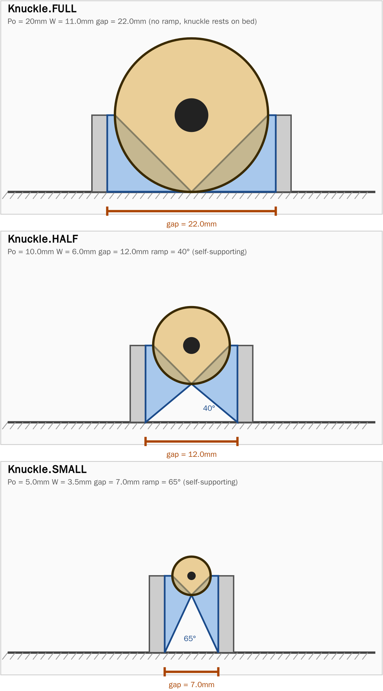
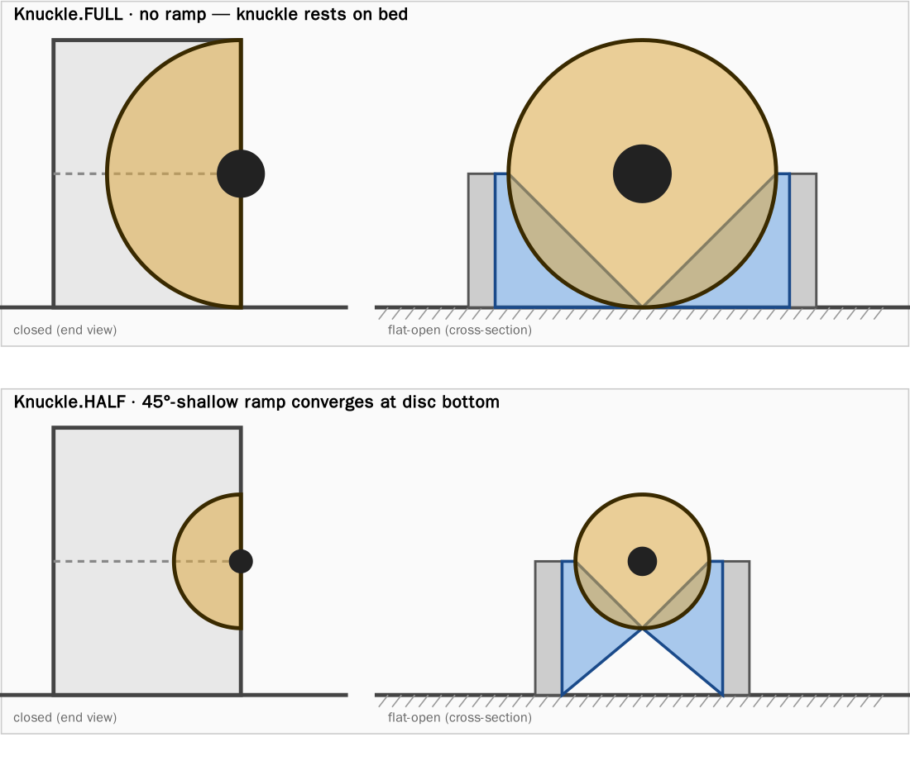

# Integrating pip-hinge into a clamshell case

A practical guide for case designers who want to add a print-in-place piano
hinge to their build123d clamshell design.

## Scope

This guide covers symmetric clamshell cases (lid and base the same height),
printed as a single piece with the hinge already attached. The hinge is
treated as a separate piano hinge fused to the case back wall — not as the
case wall itself.

## The four inputs

```python
from hinge import HingeParams, Knuckle, make_hinge

hinge = make_hinge(HingeParams(
    case_h        = 10,             # case wall height (mm)
    hinge_length  = 60,             # total hinge length along its axis (mm)
    stations      = 6,              # alternating cs/ps tab count (even, ≥ 2)
    knuckle       = Knuckle.FULL,   # FULL = no ramp; HALF = 45° self-supporting ramp
))
cylinder_side, pin_side = hinge.solids()
```

Everything else (knuckle diameter, leaf width, pin radius, pocket clearances)
is derived from these four. Two small tuning knobs remain:
`mounting_flat` (default 1 mm of flat past the disc edge for case-wall
attachment), `pivot_clearance` (radial pin/bore gap), and `clasp_clearance`
(axial gap between meshing tabs).

## The two knuckle options



Both panels above use `case_h = 10mm`, `mounting_flat = 1mm`.

### Knuckle.FULL  (Po = 2 × case_h)

The original print-in-place design. The knuckle diameter equals the full
closed-case height (lid + base stacked). When flat-open for printing, the
knuckle's bottom rests directly on the bed — no ramp, no support needed.
When closed, the back of the case shows a clean half-D bulge of full
case height.

Geometric properties:
- Knuckle protrudes `case_h` *above* the wall top (the "bump on top").
- Gap between case walls when flat-open: `2 × case_h + 2 × mounting_flat`.
- Leaf paddle bottom is on the bed; the leaf is a tall rectangle.

### Knuckle.HALF  (Po = case_h)

A more compact knuckle, diameter equal to a single wall's height. Sits
mostly above the wall top, with the lower half overhanging into the gap.
A 45°-or-shallower ramp on each leaf supports the knuckle from below as
the print rises — the two leaves' ramps converge at the knuckle bottom.

Geometric properties:
- Knuckle protrudes `case_h / 2` above the wall.
- Gap between case walls when flat-open: `case_h + 2 × mounting_flat`.
- Leaf has a sloped lower-inner face (the ramp).

### Knuckle.SMALL  (Po = max(case_h / 2, 5 mm))

The smallest knuckle the geometry will produce: 1/4 of FULL with a 5 mm
absolute floor that keeps the bore + pin big enough to print reliably on
a 0.4 mm-nozzle FDM regardless of case height. For `case_h ≥ 10 mm` the
1/4-of-FULL ratio dominates; below that, the 5 mm floor kicks in.

Geometric properties:
- Knuckle protrudes `Po / 2` above the wall.
- Ramp **steeper** than HALF's at the same `mounting_flat`. Counterintuitive
  but true: a smaller knuckle puts the disc bottom higher above the bed,
  so the leaf's ramp (from outer-bottom corner to disc bottom) rises more
  per unit of horizontal travel. At default `mounting_flat = 1 mm`, the
  ramp sits at ~25° from vertical — comfortably self-supporting (versus
  HALF at ~50° which works in practice but is at the FDM-cooling limit).
- Pin diameter for `case_h = 10 mm`: 1.9 mm — at the lower bound of
  reliable FDM print. For smaller cases the 5 mm floor preserves this.

## Closed vs flat-open



The closed-case profile shows the D-shaped bulge at the back. When flat-open
for printing, the same knuckle sits at axis `Z = case_h` (the seam between
lid and base when closed), with the leaves extending from the axis down to
the bed.

## Coordinate convention

`make_hinge()` returns the hinge centred on the origin:

- Hinge axis runs along **Y** through `(X=0, Z=0)`.
- `cylinder_side` leaf extends in **+X**, `pin_side` leaf in **−X**.
- Leaf top sits at `Z = 0`; leaf bottom at `Z = -case_h`.
- Knuckle is centred at `(0, 0)`, radius `Po/2`, extending up to `Z = +Po/2`.
- Y range: `[−hinge_length/2, +hinge_length/2]`.

To position the hinge into a clamshell case in the **flat-open** orientation
(lid + base coplanar on the bed), translate so the axis sits at the wall
top:

```python
hinge = make_hinge(params).translate((X_axis, Y_offset, case_h))
```

## Stations

`stations` is the count of alternating cs/ps tabs along the hinge length.
Must be even and ≥ 2. `clasp_width = hinge_length / stations`.

| stations | tabs                                          | typical use         |
| -------- | --------------------------------------------- | ------------------- |
| 2        | 1 cs centred, 2 ps half-end-caps              | tiny hinges (< 30mm)|
| 4        | 2 cs, 1 ps middle, 2 ps half-end-caps         | small               |
| 6        | 3 cs, 2 ps middle, 2 ps half-end-caps         | default             |
| 8, 10, … | scales up cleanly                             | long hinges         |

Below `clasp_width ≈ 3mm` the tabs become too thin to print cleanly on FDM
— a warning is emitted.

## One hinge or many?

Hinges do **not** need to run the entire case length. Multiple shorter
hinges along the back edge are usually better than one long one:

| Case back-edge length | Recommended hinges   | Notes                                       |
| --------------------- | -------------------- | ------------------------------------------- |
| < 100 mm              | 1                    | Spans most or all of the back               |
| 100–250 mm            | 1 long or 2 shorter  | 2 shorter if the lid is heavy or thin       |
| 250–450 mm            | 2                    | Position ~10–20 % in from each end          |
| > 450 mm              | 3+                   | One centred, two ~15 % from the ends        |

Multiple hinges **must be coaxial** — they all share the same hinge axis (Y
line). You position them at different Y offsets along that axis.

## Attaching the hinge to the case

Take the two solids from `make_hinge()`, position them on the case's back
edge, and boolean-union them into the case bodies.

For a clamshell with both halves coplanar on the bed during print:

```python
cs, ps = make_hinge(HingeParams(
    case_h=wall_h, hinge_length=back_edge_len, knuckle=Knuckle.FULL,
)).solids()

cs_positioned = cs.translate((0, 0, wall_h))   # axis on top of base wall
ps_positioned = ps.translate((0, 0, wall_h))

base_body = base_body + cs_positioned
lid_body  = lid_body  + ps_positioned
```

The leaf's outer face (at `X = W`) is where the case wall attaches.
`mounting_flat` controls the flat strip of leaf material past the disc edge
that the wall actually glues / fuses to — 1 mm is the default and usually
plenty for boolean union. Increase it for a larger glue surface at the cost
of a wider gap between case halves.

### Multi-hinge variant

```python
for y_centre in [-100, 0, 100]:
    cs, ps = make_hinge(HingeParams(
        case_h=wall_h, hinge_length=50, knuckle=Knuckle.FULL,
    )).solids()
    base = base + cs.translate((0, y_centre, wall_h))
    lid  = lid  + ps.translate((0, y_centre, wall_h))
```

All hinges sit on the same axis (`Z = wall_h`), at different Y positions.

## Print orientation

The natural orientation is **flat-open**: lid and base coplanar on the bed,
walls extending up, hinge axis at the top of the back walls.

- **Knuckle.FULL**: knuckle bottom rests on the bed at `Z = 0` (since
  `Po = 2 × case_h` and the axis is at `Z = case_h`). No ramp, no
  in-air bridging. Prints cleanly regardless of knuckle size.
- **Knuckle.HALF**: knuckle bottom hovers at `Z = case_h / 2`. The 45°
  ramps on each leaf converge at the knuckle bottom, supporting it from
  below. Prints supportless at any case size, but you need to choose
  `mounting_flat` small enough that the ramp angle stays ≤ 45°.

In both cases the case walls themselves provide the structural support
below the hinge — no in-air bridging needed across the wall faces.

## Opening angle

The hinge mechanism rotates freely 360°. What limits actual opening is the
**case geometry**:

| Setup                                                 | Max angle  |
| ----------------------------------------------------- | ---------- |
| Hinge axis right at the back wall top, on a table     | 180°       |
| Hinge axis offset back by `mounting_flat + Ro`        | ~270°      |
| Case picked up off the table                          | 360°       |

For a clamshell that lies flat-open on a table, 180° is the natural max.

## Sealing & closure fit

- **Same wall height**: the symmetric clamshell assumes lid and base walls
  are equal. They meet at the midplane of the assembled case.
- **Wall edge tolerance**: leave 0.1–0.2 mm clearance between mating wall
  edges so they don't bind. Add a small chamfer (0.5 mm) on the outer top
  edges of both halves to hide the seam.
- **Latch / catch**: the hinge holds the back; for the front to stay
  closed, add a friction tab, snap catch, or magnet pocket. (Out of scope
  for this doc.)

## Worked example: small box, 1 hinge

See [`examples/clamshell.py`](../examples/clamshell.py) for the full
runnable script — it builds the same 80 × 50 × 10 mm clamshell for both
`Knuckle.FULL` and `Knuckle.HALF`, exporting to
`examples/clamshell_full.{step,stl}` and `examples/clamshell_half.{step,stl}`.

Sketch:

```python
from build123d import Align, Box, Compound, export_stl
from hinge import HingeParams, Knuckle, make_hinge

CASE_H, CASE_W, CASE_D, WALL_T = 10, 80, 50, 2.5

def hollow_half(x_sign, leaf_outer_x):
    """Open-top box; back wall sits at X = leaf_outer_x on the hinge side."""
    x_min = x_sign * leaf_outer_x if x_sign > 0 else x_sign * (leaf_outer_x + CASE_D)
    align = (Align.MIN, Align.CENTER, Align.MIN)
    outer = Box(CASE_D, CASE_W, CASE_H, align=align).translate((x_min, 0, 0))
    inner = Box(CASE_D - 2*WALL_T, CASE_W - 2*WALL_T, CASE_H - WALL_T,
                align=align).translate((x_min + WALL_T, 0, WALL_T))
    return outer - inner

PIVOT_Z_OFFSET = 0.2                          # raise hinge 0.2 mm above wall top
HINGE_CASE_H  = CASE_H + PIVOT_Z_OFFSET       # size knuckle to pivot height

params = HingeParams(case_h=HINGE_CASE_H, hinge_length=64, knuckle=Knuckle.FULL)
leaf_outer = HINGE_CASE_H * params.knuckle.value / 100 + params.mounting_flat  # = W

cs, ps = make_hinge(params).solids()
cs = cs.translate((0, 0, HINGE_CASE_H))       # pivot Z = wall top + offset
ps = ps.translate((0, 0, HINGE_CASE_H))

base = hollow_half(+1, leaf_outer) + cs
lid  = hollow_half(-1, leaf_outer) + ps
export_stl(Compound([base, lid]), "clamshell.stl")
```

Three things easy to get wrong:

- The case back wall sits at **X = W** (= `Ro + mounting_flat`), not at the
  hinge axis. The wall's inner face attaches to the leaf's outer face there.
- `base + lid` returns a `ShapeList` (one-shot boolean), not a `Compound` of
  two bodies. Wrap with `Compound([base, lid])` to keep them as separate
  print-in-place bodies.
- Apply the 0.2 mm pivot Z offset to both the `case_h` you pass to
  `HingeParams` **and** the Z translation. Without the offset, the lid and
  base wall tops meet on a 0-tolerance plane and any high spot anywhere
  along the seam springs the front jaw open by ~1 mm. Passing the offset
  via `case_h` (rather than only translating by it) sizes the knuckle to
  the pivot height, so the knuckle bottom still lands on the bed when
  printed flat — important for `Knuckle.FULL`, where the "knuckle rests on
  bed, no supports" guarantee depends on that. Add corner magnet pockets
  if you want a positive latch (see `examples/clamshell.py`).

## Worked example: long box, 3 hinges

```python
case_w = 400
hinge_len_each = 60
hinge_y_centres = [-150, 0, 150]

base, lid = base_blank, lid_blank
for yc in hinge_y_centres:
    cs, ps = make_hinge(HingeParams(
        case_h=wall_h, hinge_length=hinge_len_each, knuckle=Knuckle.FULL,
    )).solids()
    base = base + cs.translate((0, yc, wall_h))
    lid  = lid  + ps.translate((0, yc, wall_h))
```

The case back walls run continuously the full 400 mm; only the hinges are
segmented.

## Common gotchas

- **Wrong case_h**: `case_h` is the *wall height* of one case half, not the
  combined closed-case height. At FULL the knuckle works out to `2 × case_h`
  in diameter — twice the wall.
- **Too many stations**: doubling stations halves `clasp_width`. Below ~3 mm
  clasps print poorly on FDM (a warning fires). For long hinges, keep
  stations at 6–10 and scale `hinge_length` instead.
- **Picking HALF for big knuckles**: at HALF the knuckle is one wall's
  height. For small cases (`case_h < ~5 mm`) the resulting bore gets close
  to the pin clearance and the pin barely fits — a hard error fires.
  Pick FULL for tiny cases.
- **Increasing mounting_flat for HALF**: bigger mounting_flat means
  shallower ramp (still self-supporting). But the gap between case halves
  also grows. 1–2 mm is usually plenty for fusion.
- **Reducing mounting_flat below pivot_clearance**: at very small
  `mounting_flat` (< `pivot_clearance`, default 0.6 mm) the leaf strip at
  X ∈ [Ro+Pc, W] collapses to zero/negative width — the bare `make_hinge()`
  result then comes back as N/2 + ~N/2 fragmented solids instead of 2.
  This is fine **as long as you fuse the hinge into a case**: each cs disc
  tab and each ps fragment shares its outer face with the case wall and
  fuses with it on boolean union. The case wall plays the role of the
  vanished leaf strip. `examples/clamshell.py` does this via
  `_split_hinge_by_side()`, which classifies the fragments by bbox X
  centre rather than unpacking 2:2.
- **Forgetting the pivot Z offset**: translating the hinge by exactly
  `case_h` gives zero design tolerance at the closed seam — any printed
  high spot then opens the front jaw. Use `case_h + 0.2 mm` as a starting
  point (0.4 mm closed-case back gap); magnets or finger pressure overcome
  that easily, and the case stops resting slightly open.

## Quick reference

For most clamshell cases:

```python
HingeParams(
    case_h          = wall_h,            # case wall height
    hinge_length    = back_edge_length,  # total length along the hinge axis
    stations        = 6,                 # default
    knuckle         = Knuckle.FULL,      # or HALF for a more compact knuckle
    mounting_flat   = 1.0,               # mm of flat past the disc for fusion
    pivot_clearance = 0.6,               # default — works on most FDM printers
    clasp_clearance = 0.4,               # default
)
```
